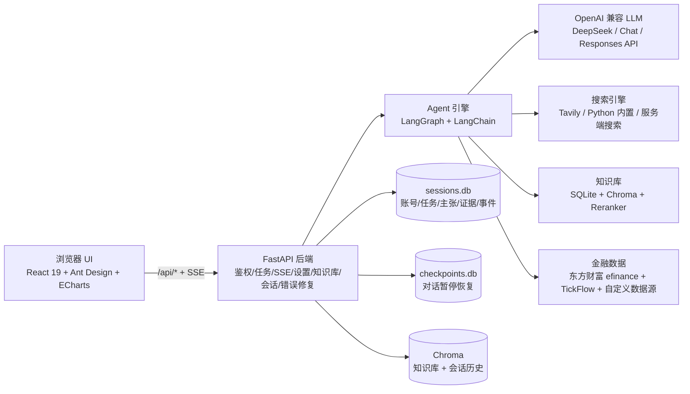

# FactShield · 事实核查研究平台 —— 项目概况与详细说明

> 本文档用于为“FactShield 路演 PPT”提供素材：先给基本情况，再逐条展开功能、实现方式、UI 与后端细节。所有内容均来自对 `D:\fact-shield` 仓库源码与 README 的通读整理。

---

## 一、一句话概括

**FactShield 是一个 AI 驱动的多智能体事实核查研究系统**：给定一个研究主题（企业、政策或风险线索），系统自动完成联网采集、事实主张提取、证据检索、双重核验、独立幻觉审查与研究底稿生成，并且每一步都有原文依据、可回查、可审计、可人工介入。

---

## 二、项目基本情况

| 项目 | 内容 |
| --- | --- |
| 项目名称 | FactShield（事实核查研究平台 / 金融研究事实核验工作台） |
| 产品定位 | 面向金融研究场景的 AI 多智能体事实核查工作台 |
| 核心价值 | 让 AI 的每一个研究结论都有可追溯的原文证据，而不是“凭模型记忆直接下结论” |
| 目标用户 | 金融研究员、分析师、风控与合规人员、需要严谨事实核查的研究团队 |
| 典型场景 | 年报经营质量核验、政策影响评估、风险线索核查 |
| 交互入口 | Web 前端（React）、CLI 聊天模式、REST API / SSE 接口 |
| 部署形态 | 单容器 Docker 镜像（前端 + 后端 + Agent 引擎一体），也可本地一键启动 |
| 当前状态 | 可本地运行、可 Docker 部署的完整实现；内置演示数据与 UI 预览模式，方便演示 |

### 解决的问题

- **AI 结论不可信**：模型直接回答无法定位“这句话来自哪份原文”。
- **人工核查效率低**：从检索、比对到写底稿需要大量重复劳动。
- **流程不可审计**：传统 AI 研究无法回看“它到底查了什么、依据是什么、为什么这么判断”。
- **幻觉风险**：需要一道独立于采集链路的“审查员”来防止流水线自说自话。

### 核心卖点（可写进 PPT 的一句话）

> 多智能体分工协作 + 双层核验 + 全链路审计 + 人工最终裁决：AI 负责把材料查全、查准、查透，人负责最后的判断。

---

## 三、系统架构总览



### 事实核查流水线

```text
plan（主控拆解）
  → collect（采集员联网采集，材料入库）
  → parse（解析员提取事实主张）
  → retrieve（检索员匹配原文证据）
  → deepen（定向深挖证据薄弱的主张）
  → score（评分员给信源可信度打标签）
  → verify（主控一级核验，发现矛盾/证据缺失时回 collect 二次取证，最多 2 轮）
  → review（独立幻觉审查员二级复核，核对引文是否真实存在）
  → assemble（底稿组装员按模板生成研究底稿）
```

---

## 四、功能清单与实现细节

### 1. 多智能体研究流水线

**是什么**：一个研究任务不是由一个模型“一口气答完”，而是拆成固定骨架的多个环节，由相互隔离的子智能体分别执行。

**怎么实现**：
- 使用 LangGraph `StateGraph` 构建固定流水线图（`agent/research/pipeline.py`），节点为：`plan → collect → parse → retrieve → deepen → score → verify → (collect) → review → assemble`。
- 每个节点都是一个“子智能体”，只消费本环节输入，产出结构化结果交回主控（Supervisor“小盾”），彼此没有通信边，保证隔离。
- 子智能体名册（`agent/research/models.py`）：主控小盾、采集员、定向深挖员、解析员、检索员、信源打分员、独立幻觉审查员、底稿拼装员、历史情景统计员。
- 采集员不是代码硬编码调搜索，而是带“受限工具集”的自主 Agent：只给 `web_search / web_extract / query_financials / query_kline / list_data_sources / archive_material / ask_user`，不给终端、子代理等系统执行能力，保障后台无人监督下的安全。
- 成本与失控防护：采集员单任务最多 10 轮工具调用、单轮最多入库 8 篇素材、任务素材总量上限 20 篇、主张上限 8 条、关键词上限 4 个。
- 可靠性：单个节点失败按固定退避（1 秒、2 秒）重启，最多 3 次；节点耗尽后抛 `NodeFailedError`，由 runner 记录错误并触发“整条流水线自动重启”（清空半成品后从头跑）。
- 任务在后台守护线程运行（`agent/research/runner.py`），前端切走页面不打断；支持终止（stop_event 在节点边界生效）。

**关键文件**：`agent/research/pipeline.py`、`agent/research/runner.py`、`agent/research/models.py`、`agent/prompts.py`（全部提示词唯一存放文件）。

---

### 2. 双重核验 + 自动二次取证

**是什么**：每条事实主张要过“主控一级核验”和“独立幻觉审查”两道闸门；证据不足或数据矛盾时自动重新联网取证。

**怎么实现**：
- **一级核验（verify 节点）**：主控拿到全部主张 + 证据 + 用户中途介入指令，逐条输出裁决（verdict）、问题类型（无/归因冲突/数据矛盾/证据缺失/口径差异）、置信度（0~1），并判断是否需要二次取证。
- **重试纪律**：仅当不同来源数据明确矛盾、主张完全没有证据、或关键主张只有单一低可信来源时，`need_retry=true` 并给出新检索关键词；证据偏少但结论一致不重试。二次取证最多 2 轮，条件边回 `collect` 节点。
- **独立幻觉审查（review 节点）**：审查员与采集/检索链路完全隔离，除主张/证据/主控意见外，还会拿到前序子智能体的处理轨迹；带两个只读工具——`read_material`（按编号读素材原文）和 `search_materials`（知识库内语义定位引文），用于核对“证据引文是否真实存在于原文”，防止整条流水线自说自话。
- 审查输出绿/黄/红三档：green→核验通过（verified）、yellow→待复核（review）、red→高度存疑（conflict），并写冲突原因。
- **单条主张重新取证**（`retry_single_claim`）：研究员对某条主张点“重新取证”后，后台线程执行“联网补采（最多 3 篇）→ 信源打分 → 混合检索 → LLM 摘录证据 → 单独复核”，事件照常推送到研究动态；**人工裁决过的主张只更新复核意见，不会被自动复核推翻状态**。

**关键文件**：`agent/research/pipeline.py`、`agent/prompts.py`（VERIFY_PROMPT / REVIEW_AGENT_PROMPT / JUDGE_EVIDENCE_PROMPT）、`agent/research/runner.py`。

---

### 3. 人工复核工作台

**是什么**：流水线跑完后，系统不直接给出“最终答案”，而是把疑点逐条交给研究员做最终裁决。

**怎么实现**：
- 每条主张都展示：主张原文、类别、置信度、主控一级核验结论、独立审查结论、存疑原因、证据列表（原文摘录 + 来源 + 可信度 + 链接 + 定位）。
- 裁决动作四种：保留注明（keep）、改写（rewrite）、排除（remove）、不采纳（reject），映射到最终状态 verified / conflict；裁决意见与备注写入数据库，成为审计记录。
- 裁决草稿先在浏览器本地暂存（localStorage），支持暂存、撤回、重新处理；全部裁决提交后任务进入“已完成（ready）”状态。
- 底稿会随裁决结果用纯代码幂等重建（`_build_report`），保证人工判断生效。
- 任务列表页显示“等你复核 / 待处理疑点数”等 KPI，引导用户进入复核流程。

**关键文件**：`api/routers/tasks.py`（resolve_claim）、`agent/research/store.py`（resolve_claim）、`ui/src/components/Workbench.tsx`、`ui/src/utils/reviewDrafts.ts`。

---

### 4. 研究动态实时播报（SSE）

**是什么**：任务执行过程中，前端像“现场直播”一样看到小盾每一步做了什么：检索了什么、打开了哪些来源、判断依据是什么。

**怎么实现**：
- 每个事件为结构化 JSON：`{actor, kind, payload:{title, speech, details, metrics, progress, tone}}`，由 `publish_event` 统一落库（`task_events` 表）并广播给所有 SSE 订阅队列。
- SSE 端点 `GET /tasks/{id}/events`：先回放已持久化事件，再实时订阅；靠事件 seq 去重，退出页面再进入不丢历史。
- 主流水线、重新取证、历史统计三路事件共用同一通道；连接 15 秒无事件发 `: ping` 保活，防代理断连。
- 前端有“打字机”式播报、执行依据卡片、指标条；进度只增不减（二次取证回退不会把进度条拉回去）。
- 任务专属对话中模型的思考过程（reasoning）、工具调用、服务端搜索记录也会以事件形式流式展示。

**关键文件**：`agent/research/runner.py`（publish/subscribe）、`api/routers/tasks.py`（task_events）、`ui/src/components/Workbench.tsx`、`ui/src/services/api.ts`（streamTaskEvents）。

---

### 5. 子智能体执行监控

**是什么**：可视化查看每个子智能体的执行过程、工具调用轨迹、真实耗时与产出物，便于定位问题环节。

**怎么实现**：
- `GET /tasks/{id}/agents`：返回每个智能体的事件数与工具调用数。
- `GET /tasks/{id}/agents/{agent}`：返回某个智能体的完整执行过程——启动输入、事件时间线、每次工具调用的参数与结果、产出物（计划/素材/主张/证据/审查意见/底稿）、相关错误与修复记录。
- 每个节点的真实起止时间记录在 `task_node_runs`，前端展示的“运行时间”用真实耗时聚合，不再用事件时间片估算；老任务回退为时间片估算。
- 前端用 React Flow 画拓扑图：小盾居中分发到各执行单元，独立审查员单列，冲突主张时出现红色回边；点击节点打开抽屉看完整执行记录。

**关键文件**：`agent/research/trace.py`、`api/routers/tasks.py`、`ui/src/components/AgentTopology.tsx`。

---

### 6. 历史情景时序统计（复盘）

**是什么**：对关注指标做客观的历史时序统计（月度/季度/年度），用同类历史事件的前后数据路径作为研究参照。

**怎么实现**：
- 历史统计员（后台线程）先由 LLM 按研究主题挑选 2~3 个同类历史事件与统计指标；用户也可自定义：指标、场景、时间范围（YYYY-MM）、统计频率（auto/monthly/quarterly/yearly）。
- 每个事件联网检索公开数据，LLM 只抽取检索文本中明确出现的数值点（最多 8 个/事件），禁止推测、插值；数据完整度 = 实际点数 / 期望点数。
- 结果保存为结构化 payload：指标、单位、事件列表（名称/时段/描述/数据点/来源链接）、完整度；前端用 ECharts 绘制“T0 对齐”的同类事件前后变化路径，支持相对 T0 / 原始数值切换，并提示数据质量问题（如混用统计周期被排除）。
- 统计结果可一键“加入研究底稿附件 A”，幂等且不重复；附件只做客观描述，不做趋势判断。

**关键文件**：`agent/research/history.py`、`api/routers/tasks.py`（history-analysis 系列）、`ui/src/components/AnalyticsView.tsx`。

---

### 7. 研究底稿生成与导出

**是什么**：任务完成后自动生成一份带完整证据链的研究底稿，可导出 Markdown / PDF / Word。

**怎么实现**：
- 底稿先由 LLM 写一段摘要（只基于核查结果，禁止引入新事实），再由 `_build_report` 按模板用库中结构化数据拼装：任务信息、摘要、主张与证据链（每条主张：可信度标签、置信度、两层核验结论、存疑原因、支持/质疑证据及原文摘录）、参考信源、附件 A（历史统计）、免责声明。
- 底稿完全可重建（幂等）：人工裁决后、历史统计附入后都会用同一函数重新生成，不残留旧内容。
- 导出实现：Markdown 直接返回；PDF 用 reportlab（中文字体微软雅黑，缺失回退自带 CID 字体）；Word 用 python-docx（微软雅黑、表格列宽按内容占比分配）。
- 前端预览底稿用 react-markdown + GFM，导出前先校验文件魔数（%PDF / PK），防止坏文件。

**关键文件**：`agent/research/pipeline.py`（_build_report）、`agent/research/export.py`、`api/routers/tasks.py`（report）、`ui/src/components/ReportsView.tsx`。

---

### 8. 全链路审计

**是什么**：任务从创建到终判的每一步都留痕，可以完整回看。

**怎么实现**：
- 事件时间线：`task_events`（谁、何时、说了什么、依据是什么）。
- 工具调用轨迹：`agent_tool_traces`（子智能体每次调用哪个工具、传了什么参数、返回了什么）。
- 人工裁决记录：主张上的 `human_action / human_note / updated_at`。
- 流程错误与修复记录：`flow_errors`（失败节点、堆栈、尝试次数、自动/人工修复状态机）。
- `GET /tasks/{id}/audit-log` 返回完整 JSON，前端可直接下载审计日志文件。

**关键文件**：`agent/research/store.py`、`agent/failures.py`、`api/routers/tasks.py`。

---

### 9. 任务专属对话与中途指导

**是什么**：任务执行中可以随时向“小盾”提问，也可以提交调整指令让流水线在下一个核验点执行。

**怎么实现**：
- **任务专属对话**：`POST /tasks/{id}/chat` 复用通用对话 Agent，自动注入当前任务上下文（任务信息 + 主张清单 + 复核结论），可选择“聚焦某条主张”；使用独立会话 `task-{task_id}`，历史持久化，SSE 流式返回。
- **中途介入（guidance）**：`POST /tasks/{id}/guidance` 把研究员指令入库，流水线在节点边界消费（`_consume_guidance`）并立即播报；指令会拼入一级核验提示词。前端支持选择“哪一步需要重新看”、追加附件（附件先转成 Markdown 再拼入指令）。
- **ask_user 提问工具**：主控或子智能体信息不足时，可调用 `ask_user` 向研究员提问（选项或自由输入），问题落库、事件推送、线程阻塞等待；用户作答后唤醒线程，答案以工具结果回到 LLM 上下文，并且已答问题对所有后续节点全局可见、不重复提问。

**关键文件**：`api/routers/tasks.py`、`agent/tools/ask_user.py`、`agent/questions.py`、`ui/src/components/Workbench.tsx`、`ui/src/components/SupervisorAssistant.tsx`。

---

### 10. 通用 Agent 对话（小盾）

**是什么**：除研究流水线外，还有一个带全套工具、可持久化、可暂停恢复的通用对话 Agent。

**怎么实现**：
- 入口 `POST /chat/stream`，SSE 事件类型：token（正文）、think（思考）、tool（工具状态）、context（压缩提示）、question/answer（提问）、done/error。
- 工具按组划分（`agent/tools/toolslist.py`），由 Agent 用 `activate_toolset` 自主激活，避免一次绑全部工具占用上下文：
  - terminal：终端命令、用户画像；
  - web：联网搜索、读网页、下载文件；
  - document：Markdown 文档转换、视觉模型 AI 识别图片/扫描 PDF；
  - memory：本地知识库精确检索、历史对话回忆；
  - finance：A 股财报、K 线行情、实时行情、自定义数据源。
- 常驻工具：工具集激活、技能调用（use_skill）、子代理（subagent，隔离执行且不能套娃）、ask_user。
- 基于 LangGraph 主图 + SQLite checkpointer：支持暂停 / 恢复 / 丢弃一轮对话（服务重启后也能恢复）。
- 上下文自动压缩：默认在窗口 80% 时触发，调用 LLM 把历史压成摘要（压缩到约 5%），用户可在设置页调触发比例（10%~100%）；压缩不影响完整历史存档。
- 会话持久化：结构化状态在 sessions.db，每轮正文切块存 Chroma（独立 collection），支持“回忆历史对话”的向量 + reranker 检索；用户画像（最多 50 条）长期记忆。

**关键文件**：`agent/agent.py`、`agent/core/loop.py`、`agent/core/context.py`、`agent/session/`、`agent/tools/`。

---

### 11. Agent 技能系统

**是什么**：把可复用能力做成“技能包”，Agent 自主判断何时调用，用户无需手动触发。

**怎么实现**：
- 每个技能是一个目录：`agent/skills/<skill_id>/SKILL.md`（frontmatter：name/description/version/timeout + 操作说明），可选 `run.py`（可执行型）和 `assets/`。
- 纯指令型：`use_skill` 返回操作说明，Agent 按步骤使用已有工具执行；可执行型：子进程隔离运行 `run.py`（stdin 传 JSON 任务、stdout 返回结果），带超时。
- 启动时扫描技能目录，把“名称 + 描述”注入系统提示词；通过 mtime 快照实现热重载，改技能文件不用重启服务。
- 内置技能示例：`text-analyzer`（文本统计，可执行型）、`evidence-review`（证据复核，纯指令型）。
- 提供只读接口 `GET /api/skills` 与自检/冒烟脚本（`agent/skills/check.py`、`smoke.py`、`e2e.py`）。

**关键文件**：`agent/skills/loader.py`、`agent/skills/runner.py`、`agent/tools/skill.py`。

---

### 12. 知识库（RAG）

**是什么**：本地 Markdown 文档入库，支持语义检索；研究任务采集的素材也统一进知识库。

**怎么实现**：
- 入库：Markdown 切块（1000 字符、重叠 200）写入 Chroma 向量库，元数据登记 SQLite（group_id、chunk_count）；同一文档所有块共享 group_id，任务素材用 `task:{task_id}:{seq}` 标识。
- 混合检索（`agent/memory/hybrid.py`）：向量召回（Chroma）+ 关键词召回（SQLite FTS5 trigram，支持中文子串；Chroma where_document $contains 兜底）→ RRF 融合 → Reranker 精排（未配置时按融合分降级）。
- 对话轮次、任务素材与知识库文档共用同一套 Embedding 配置但分库分 collection。
- 接口：`POST/GET/DELETE /knowledge/documents`；`group_id` 前缀可回溯某任务的全部素材。

**关键文件**：`agent/memory/vector_store/store.py`、`agent/memory/SQLite/save.py`、`agent/memory/hybrid.py`、`agent/memory/reranker/rerank.py`。

---

### 13. 数据源与金融数据

**是什么**：核验金融主张时能直接查一手数据，而不是只靠网页搜索。

**怎么实现**：
- **A 股财报（东方财富）**：`query_stock_financials` 查营业收入、净利润、同比、ROE、毛利率，报告期可选；优先 HTTPS 直连东方财富接口，失败时回退 efinance 库。
- **行情 K 线（TickFlow）**：`query_stock_kline` 支持 A 股/美股/港股日/周/月 K（最多 120 根）；未配置 API key 时自动用免费档（历史日 K 与标的信息），配置后支持实时行情快照。
- **自定义数据源**：用户在设置页配置 HTTP 或 Python SDK 接入规范（最多 50 个，specification 加密入库），启用后 `list_data_sources` 把规范交给 Agent，Agent 按规范取数。
- **搜索引擎三选一**：Tavily（需 key，用户可在前端配置）、Python 内置（必应中国版爬虫，免 key，开箱即用）、DeepSeek Responses API 服务端搜索（免搜索 key，建议 deepseek-v4-flash）。

**关键文件**：`agent/tools/finance.py`、`agent/tools/datasource.py`、`agent/searchengine.py`、`agent/session/data_sources.py`。

---

### 14. 多用户与安全

**是什么**：支持多账号、数据隔离、密钥加密存储。

**怎么实现**：
- 注册 / 登录 / Token（30 天有效）、显示名、头像（PNG/JPEG/WebP，魔数校验，≤2MB，BLOB 入库）、修改密码（改密后踢掉其他会话）。
- 密码用 PBKDF2-SHA256（10 万轮）加盐哈希；登录 token 随机生成入库。
- 用户在前端保存的模型 API key、Tavily key、数据源规范统一用 Fernet 加密入库；master key 来自 `FS_MASTER_KEY` 环境变量或自动生成的 `.master_key` 文件（挂数据卷持久化）。
- 任务、会话、错误记录、提问全部按 user_id 隔离；越权访问一律 404，不暴露“存在性”。
- `/capabilities` 只返回各能力是否就绪的布尔值，不泄露任何密钥。
- 默认管理员 `admin@factshield.dev / admin123`，可用环境变量覆盖。

**关键文件**：`agent/session/users.py`、`agent/session/crypto.py`、`agent/session/model_config.py`、`api/core/security.py`、`api/routers/auth.py`。

---

### 15. 附件与文档处理

**是什么**：研究任务可带附件（PDF/Word/Excel/TXT），Agent 对话也可处理本地文档。

**怎么实现**：
- 任务附件：`POST /tasks/uploads` 上传（最多 5 个、单个 ≤10MB），用 markitdown 转 Markdown 暂存（`task_uploads`），建任务时绑定为素材，参与首轮主张提取；流程重启时按原样重新入库。
- 文档转换：`POST /documents/convert?mode=normal` 用 markitdown 转 Markdown，可选存知识库。
- AI 识别：`mode=ai` 用视觉大模型逐页识别图片和扫描版 PDF（PyMuPDF 150dpi 渲染每页再识别），输出 Markdown。
- Agent 读文件：`POST /documents/upload` 先把文件落盘返回路径，Agent 按路径调用转换/识别工具，避免图片内容直接塞进消息上下文。

**关键文件**：`api/routers/tasks.py`、`api/routers/documents.py`、`agent/tools/convert.py`。

---

### 16. 流程错误记录与自动修复

**是什么**：任何 Agent 流程失败都被记录，可自动或手动“一键修复”。

**怎么实现**：
- `record_error` 统一登记五类流程：对话（chat）、子代理（subagent）、研究流水线（research）、单条重取证（research_retry）、历史统计（history_analysis），含失败节点、提示词、完整堆栈、尝试次数。
- 状态机：failed → repairing → repaired / repair_failed；失败后按流程类型自动重启（研究任务清空半成品整条重跑、重取证重跑、历史统计重跑、子代理用原提示词重跑、对话轮次重跑）。
- API：`GET /errors`（列表/过滤/分页）、`GET /errors/{id}`（详情含堆栈）、`POST /errors/{id}/repair`（手动触发修复）、`POST /errors/{id}/mark-repaired`（人工标记）。
- 设置页内置“错误中心”，可查看失败列表、详情并触发修复。

**关键文件**：`agent/failures.py`、`api/routers/errors.py`、`ui/src/components/SettingsView.tsx`。

---

### 17. 全局工作区搜索

**是什么**：跨所有任务搜索任务、主张、证据。

**怎么实现**：
- 后端 `GET /tasks/search?q=` 在用户自己的数据内模糊搜索：任务（标题/主题/公司）、主张（表述）、证据（标题/出处/引文）。
- 前端顶栏搜索框 280ms 防抖，结果分组展示；点击直接跳转到对应任务的主张或证据位置。

**关键文件**：`agent/research/store.py`（search）、`api/routers/tasks.py`、`ui/src/components/AppShell.tsx`。

---

### 18. 演示与预览模式

**是什么**：未接入真实后端或未配置密钥时，也能完整展示产品形态。

**怎么实现**：
- 内置一组高质量示例研究（宁德时代、比亚迪、贵州茅台、新能源汽车政策），含主张、证据、Agent 状态与执行过程（`ui/src/mocks/research.ts`）。
- UI 预览模式：展示完整页面但不写后端；流程演示任务：模拟 8 步处理动画停在“待复核”，不访问外部数据。
- 真实任务与演示任务严格区分，页面上有明确横幅提示，避免混淆。

**关键文件**：`ui/src/mocks/research.ts`、`ui/src/services/mockApi.ts`、`ui/src/store.ts`。

---

## 五、UI（前端）情况

### 技术栈

| 项目 | 技术 |
| --- | --- |
| 框架 | React 19 + TypeScript |
| 构建 | Vite 7（开发代理 /api → 8000） |
| 组件库 | Ant Design 5 + Ant Design Icons |
| 状态管理 | Zustand |
| 数据请求 | TanStack Query（轮询/缓存/失效） |
| 可视化 | ECharts（echarts-for-react） |
| 流程图 | React Flow |
| 其他 | react-markdown + GFM、dayjs、zod（接口运行时校验）、pnpm 11 |

### 页面与功能

| 视图 | 主要功能 |
| --- | --- |
| 登录页 | 注册 / 登录 / 忘记密码（修改密码），带动画过渡与表单校验 |
| 任务中心 | KPI 统计卡（进行中/等你复核/已完成/全部）、任务列表（状态/进度/待处理数）、研究模板（年报经营质量/政策影响评估/风险线索核查）、新建研究模态框（研究问题、附件上传、研究对象、研究类型、优先信源） |
| 研究工作台 | 运行中：实时进度、研究动态播报（打字机 + 依据卡）、打断并提交调整指令（可多选步骤、带附件）、子智能体状态汇总；复核态：主张清单（只看疑点/全部）、证据查看器（原文摘录、来源可信度、链接、支持/质疑）、双层核验结论、四种人工裁决、重新取证、复核草稿暂存/撤回 |
| 执行监控 | React Flow 子智能体拓扑图（隔离状态横幅、冲突回边）、Agent 抽屉展示完整执行记录（输入/时间线/工具轨迹/产出/错误） |
| 历史情景复盘 | 自定义比较口径（指标/场景/时间范围/频率）、ECharts T0 对齐曲线、样本来源表、数据质量提示、加入底稿附件 |
| 报告页 | 底稿封面与交付统计、Markdown 预览、导出 PDF/Word（可校验文件格式）、审计日志下载、版本记录 |
| 三路检索工作台 | 一次提问并行覆盖网络/数据源/知识库三类资料，分栏展示结果、工具调用与思考过程，历史记录保留在当前账号浏览器 |
| 设置页 | LLM/视觉模型配置（多模型可增删）、搜索引擎切换与 Tavily key、LLM 调用模式（Chat/Responses API）、上下文压缩阈值、会话管理（历史/压缩/删除）、自定义数据源管理、流程错误中心 |
| 全局框架 | 顶栏（Logo、导航、工作区全局搜索、后端连接状态、账号头像/改名/改密/登出）、小盾对话抽屉（任务上下文自动绑定、快捷要求、附件、思考/工具过程、暂停/恢复/丢弃） |

### 视觉与交互特色

- 自定义设计系统（`workspace-theme.css` + MiSans 字体）：深青/暖金/警示红三色语义，贴合“严谨研究”气质。
- 可信 / 待复核 / 高度存疑三色标签贯穿全站。
- 强调“可追溯”：每个结论都能看到原文引用、来源可信度与双层核验记录。
- 真实数据与演示数据严格区分，所有页面都有明确的“正在连接 / 演示 / 预览”状态提示。

---

## 六、后端（API 与 Agent 引擎）情况

### 技术栈

| 项目 | 技术 |
| --- | --- |
| Web 框架 | FastAPI + Uvicorn |
| Agent 框架 | LangGraph + LangChain |
| LLM 接入 | OpenAI 兼容客户端（Chat Completions / DeepSeek Responses API），支持思考模式与服务端搜索 |
| 存储 | SQLite（sessions.db 业务数据 + checkpoints.db 检查点）+ Chroma 向量库（知识库 / 会话历史）+ 文件系统（uploads / downloads） |
| 搜索引擎 | Tavily / Python 内置爬虫 / Responses API 服务端搜索 |
| 金融数据 | 东方财富 efinance、TickFlow |
| 文档处理 | markitdown、PyMuPDF、视觉大模型 OCR |

### API 模块（全部挂在 `/api` 前缀，开发时根路径直连）

| 路由 | 职责 |
| --- | --- |
| `/auth` | 注册、登录、登出、用户信息、头像、显示名、改密 |
| `/tasks` | 研究任务全生命周期：创建/列表/详情/删除、SSE 播报、终止、中途介入、提问回答、人工裁决、重新取证、底稿导出、审计日志、执行监控、历史统计、任务对话、全局搜索 |
| `/chat/stream` | 通用 Agent 流式对话 |
| `/sessions` | 会话历史、上下文压缩、暂停/恢复/中止、会话提问 |
| `/settings` | LLM/视觉模型配置（加密）、搜索引擎、LLM 调用模式、上下文压缩阈值 |
| `/knowledge` | 知识库文档入库/列表/删除 |
| `/documents` | 文档转换（normal/AI）、Agent 附件上传 |
| `/data-sources` | 自定义数据源列表/保存 |
| `/capabilities` | 能力就绪状态（只返回布尔值） |
| `/errors` | 流程错误列表/详情/修复 |
| `/skills` | 技能列表（只读） |
| `/health` | 健康检查 |

### 核心机制

- **SSE 双通道**：任务事件通道（研究流水线/重取证/历史统计）与会话事件通道（对话提问/回答），都是“落库 + 订阅队列广播”，先回放后实时。
- **后台线程模型**：研究流水线、单条重取证、历史统计、对话 worker、错误修复 worker 均在后台线程执行，API 立即返回、事件异步推送。
- **LangGraph 图**：研究流水线是固定骨架图；通用对话是带 checkpointer 的 Agent 循环图（每轮一个 thread_id，支持暂停恢复）；子代理图不含 subagent 防止套娃。
- **提示词工程**：所有 Agent 提示词集中在 `agent/prompts.py`；判定类提示词强制输出 JSON，便于确定性解析；全程约束“不荐股、不预测、不编造”。
- **可降级设计**：搜索、Reranker、金融数据、文档转换等能力都有明确的降级路径或错误提示，不静默编造。

---

## 七、数据模型与持久化

### sessions.db（业务主库）

- 账号体系：users、tokens、profile_facts（用户画像）
- 用户配置：user_model_configs（加密模型密钥）、user_search_settings、user_context_settings、user_llm_settings、user_data_sources（加密接入规范）
- 研究任务：research_tasks、task_materials（素材）、task_uploads（附件）、claims（主张）、evidence（证据）、claim_evidence（关联）
- 过程留痕：task_events（播报/审计）、task_node_runs（节点耗时）、task_guidance（介入指令）、agent_tool_traces（工具轨迹）、agent_questions（提问）、history_analyses（历史统计）、flow_errors（错误与修复）

### 其他存储

- checkpoints.db：LangGraph 对话检查点（暂停/恢复）
- Chroma（agent/session/chroma_db）：会话轮次正文
- Chroma（agent/memory/vector_store/chroma_db）：知识库与任务素材向量
- agent/workspace/uploads、downloads：运行时文件

### Docker 持久化三卷

| 卷 | 内容 |
| --- | --- |
| factshield-session | 账号、会话、检查点、加密配置、master key |
| factshield-memory | 知识库、向量库 |
| factshield-workspace | 上传附件、下载文件 |

---

## 八、部署与运维

- **单容器部署**：Dockerfile 多阶段构建，node:22-alpine 编译前端 → python:3.13-slim 运行 FastAPI；后端同时托管页面（`/`）与 API（`/api/*`），无需 nginx。
- **国内开箱**：npm/pnpm 走 npmmirror、pip 走阿里云，可用构建参数覆盖。
- **数据快照**：`deploy/snapshot_seed.py` 把本机运行数据做成快照打进镜像，首次启动灌入运行目录，实现“云端 = 本地”；之后云端数据独立持久化，不被种子覆盖。
- **一键启动（Windows）**：`start-ui.bat` 自动检测 Python 环境、安装前端依赖、启动 API、健康检查通过后打开前端。
- **CLI 模式**：`python -m agent.agent` 直接在命令行与小盾对话。
- **监控**：`monitor_memory.py` 用于内存监控；`/health` 健康检查。

---

## 九、可写进路演 PPT 的素材要点（速览版）

1. **一句话定位**：AI 多智能体事实核查研究平台，让每个结论都有原文依据。
2. **解决什么痛点**：AI 幻觉、结论不可溯源、人工核查效率低、流程不可审计。
3. **核心能力矩阵**：
   - 多智能体流水线（9 类角色分工隔离）
   - 双重核验（主控一级核验 + 独立幻觉审查）
   - 自动二次取证（证据不足自动补查，最多 2 轮）
   - 人工最终裁决（保留/改写/排除/不采纳）
   - 全链路审计（事件、工具轨迹、裁决记录全程留痕）
   - 底稿一键导出（Markdown/PDF/Word）
   - 历史情景复盘（同类事件 T0 对齐比较）
   - 通用 Agent 工作台（联网/金融/文档/知识库/技能）
4. **技术亮点**：
   - LangGraph 固定骨架 + 受限工具集子智能体，安全可控
   - 向量 + 关键词 + Reranker 混合检索
   - SSE 实时播报 + 事件持久化回放
   - 密钥 Fernet 加密、按用户数据隔离
   - 单容器一键部署，云端本地数据一致
5. **演示路径建议**：新建研究 → 看实时播报 → 展示双重核验与证据链 → 人工裁决 → 导出底稿 → 历史复盘。

---

> 说明：本档由对项目源码的完整阅读整理而成，覆盖 README、API 路由、Agent 流水线、记忆系统、前端组件与部署脚本。如需进一步压缩成单页路演稿，可直接取用“第九节”要点展开。
